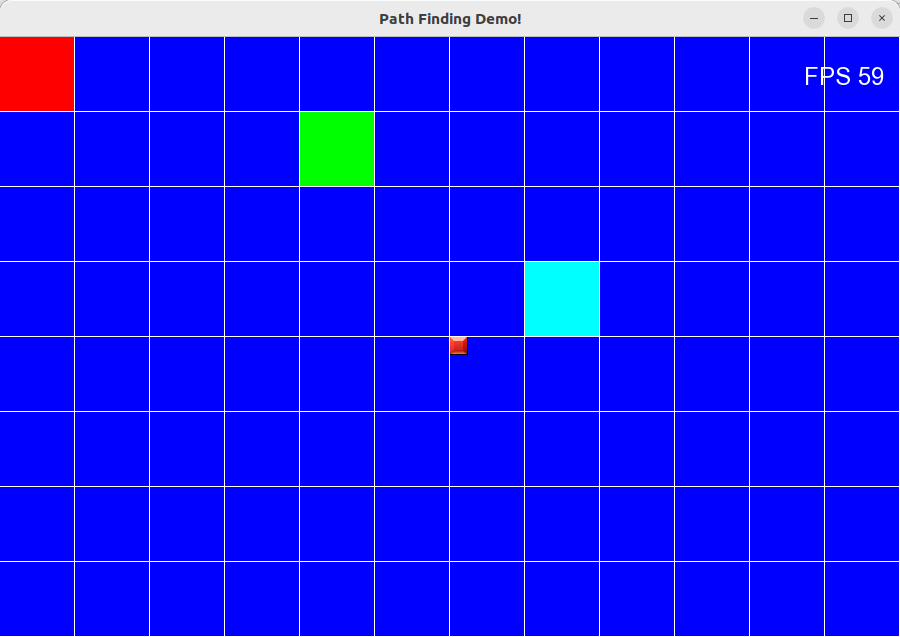
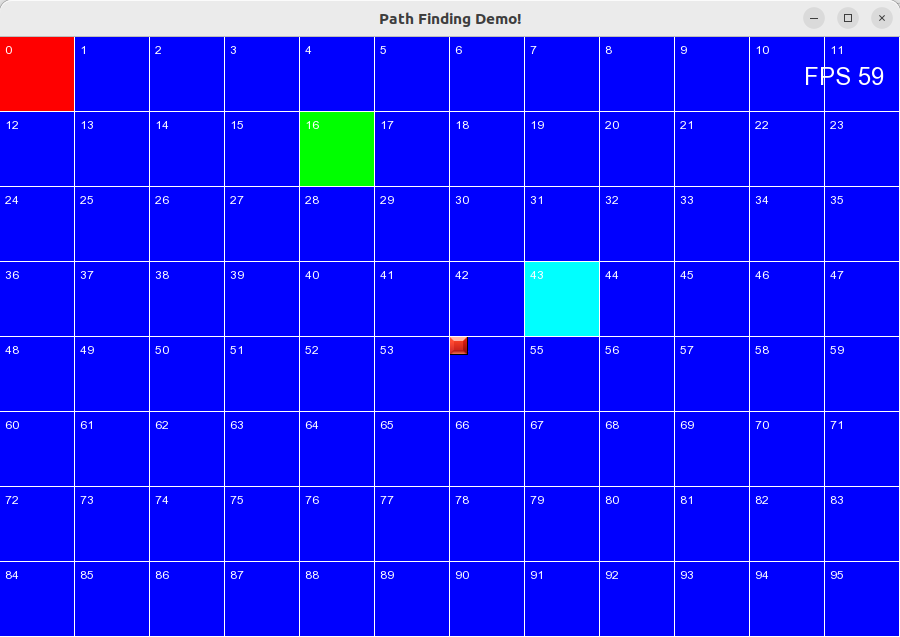
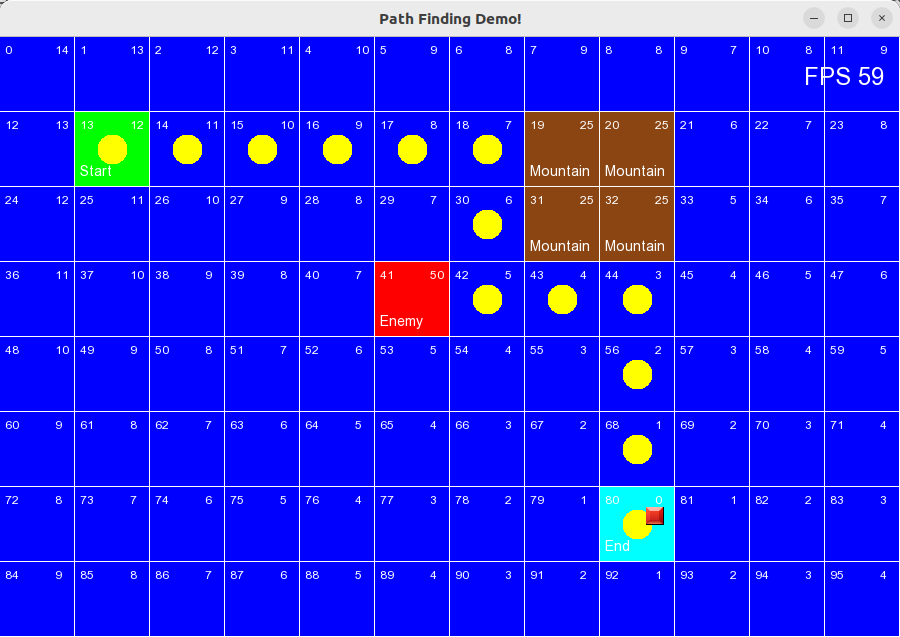

# Pathfinding Demo with C++/SFML

This project is a C++ and SFML-based demonstration of the distance map BFS pathfinding algorithm. It provides a simple visual interface to understand how the algorithm works.

## Description

The application displays a grid-based map with a start point, an end point, obstacles (mountains), and enemies. The user can move the end point around the map using the `w`, `a`, `s`, and `d` keys.

Every time the end point is moved, the application recalculates the distance map using a Breadth-First Search (BFS) algorithm. This map determines the shortest path from the start point to the end point, avoiding obstacles.

The calculated path is then visually represented on the screen by a series of yellow circles, clearly marking the route from the start to the end.

## Features

- **Interactive Grid**: A visual representation of the map.
- **Movable End Point**: Control the destination of the pathfinding algorithm.
- **Real-time Path-finding**: The shortest path is recalculated and redrawn whenever the end point's position changes.
- **Distance Map BFS**: The core algorithm used for pathfinding.
- **Obstacles and Enemies**: Demonstrates how the algorithm navigates around different types of impassable terrain.

## Screenshots

Here are some screenshots of the application in action:

*Caption: The initial grid.*

*Caption: The numbered grid.*

*Caption: The end point is moved, and the path is recalculated around obstacles.*

## How to Run the Demo

1.  **Clone the repository.**
2.  **Build the project using CMake.**
3.  **Run the executable.**
